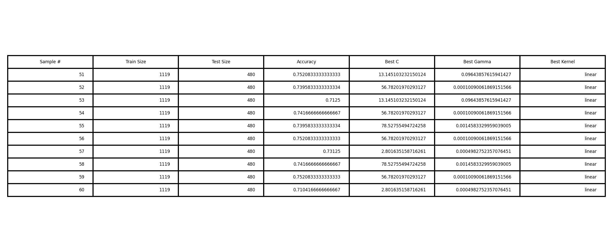
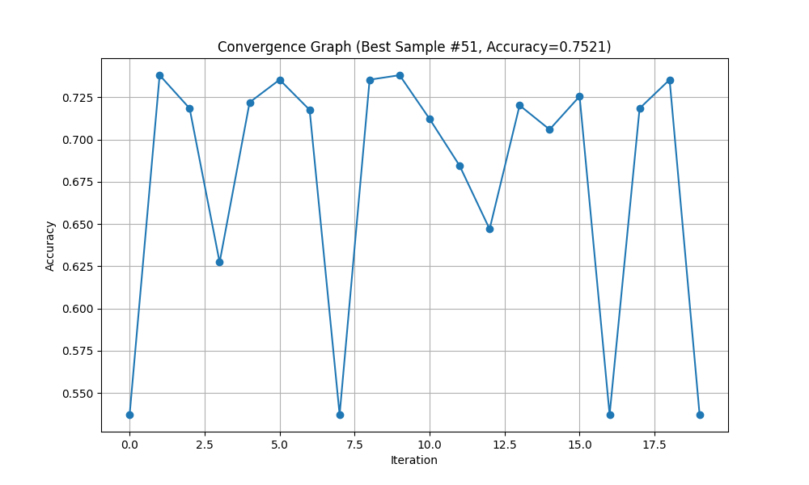

# Parameter_optimization
## Dataset
- **Name**: Wine Quality (Red)
- **Source**: UCI Machine Learning Repository
- **Samples**: 4,898
- **Features**: 11 physicochemical properties
- **Target**: Quality (Binary: 1 if quality ≥6, else 0)

## Results
### Table 1: Optimization Results


### Best Performing Model
- **Top Samples**: #51, #56, #59 (tied at 75.21% accuracy)
- **Optimal Parameters**:
  ```python
  # Most frequent best configuration:
  SVC(C=56.782, gamma=0.0001, kernel='linear')
  
  # Alternative equally-good configuration:
  SVC(C=13.145, gamma=0.0964, kernel='linear')

### Convergence Graph

